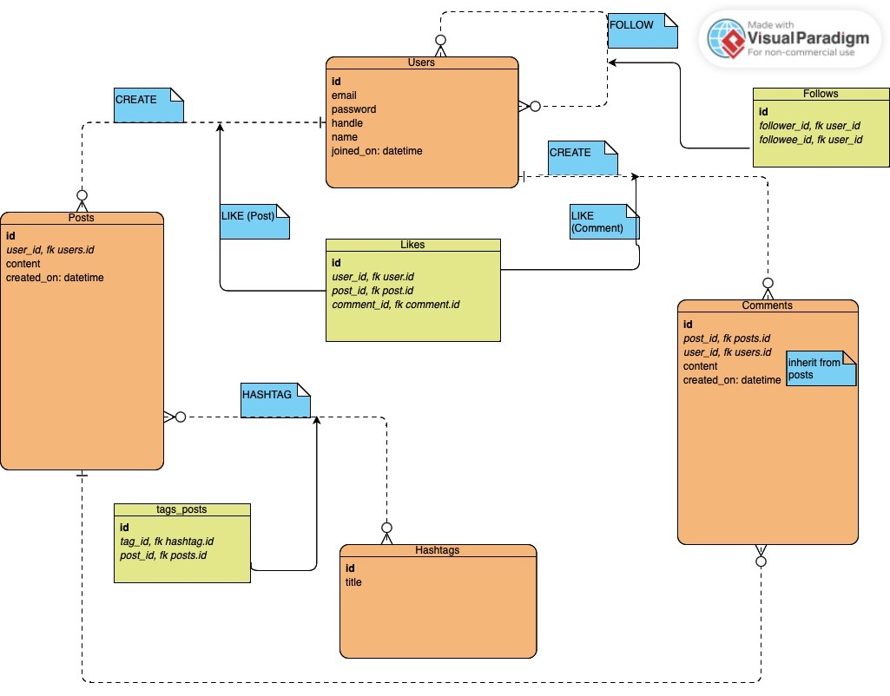

# TWITTER CLONE PROJECT

For this project, I am extending the project from the brief here: [Makers Academy Brief](./project_brief.md)

### DEPENDENCIES:

See Pipfile

**Packages**

* pytest = "*"
* psycopg = "*"
* flask = "*"
* pytest-playwright = "*"
* pytest-xprocess = "*"
* py = "*"
* playwright = "*"

<br>


**Dev-Packages**

* autopep8 = "*"

<br>

**Requires**

* python_version = "3.11"

<br>
<hr>
<br>
I have created the following project design:

## ER DIAGRAM:




## EXTENDED USER STORIES:

I would like to have the following extended user stories:

```

As a user,
So that I can let others know my thoughts and what I am doing,
I would like to create posts

As a user,
So that others can see my post among other posts of similar topics,
I would like the option to add hashtags to my posts

As a user,
So I can engage with others,
I would like users to be able to comment on my posts

As a user,
So I can navigate posts and users easily,
I want to see the user's display name and handle above their post or comment
I would this string to be formatted for readability, and to link to the user's page

As a user,
So I can keep updated with particular users posts,
I would like to be able to follow users

As a user,
So that I can give feedback to a post without commenting,
I would like to 'Like' posts and comments

As a user,
So that I can better appreciate the context of a post or comment,
I want to see what time it was made

As a user,
So that I can see what others are saying,
I want to see all posts in reverse chronological order

As a user,
So that I can see the hottest posts,
I want to be able to sort posts by Likes in descending order

As a user,
So that I can see the hottest topics,
I want to be able to search posts by hashtag

As a user,
So that I can find another user,
I want to be able to search users by handle (@username)

As a user,
So that I can know more about myself and other users,
I would like to be able to see views for all posts, all comments, and all likes from a specified user

```

## COMPLETED:

* project design & user stories
* chwitter.sql, reflects project design
* Started User class & User Repository -- created before project design, need to ammend to reflect new design and write tests.
* Started routes for app.py & placeholder html templates for landingpage, homepage (all), new_post, show_comment, show_post  -- created before project design, need to ammend to reflect new design and write tests.

## TODO:

* Flask session, and user authentification
* Post class & Post Repository
* Comment class and Comment Repository - inherit from Post
* #Like, #Follow, #Hashtag -- add as methods into User, Post, and Comment repositories